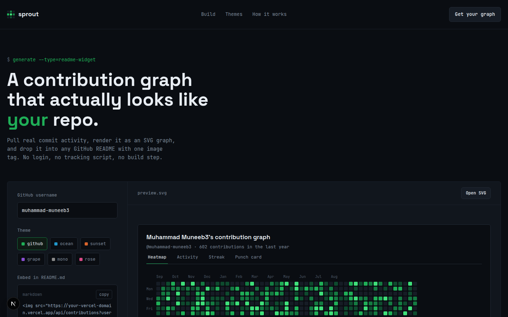

# GitHub Sprout

GitHub Sprout is a README contribution graph widget generator. It lets developers create clean SVG contribution graphs for their GitHub profile or project README with a simple image URL.

The app includes a live builder where users can enter a GitHub username, choose a theme, switch graph styles, preview the result, and copy the Markdown embed code.



## Features

- Dynamic SVG endpoint for GitHub README files
- Username-based graph generation
- Graph styles: `heatmap`, `activity`, `streak`, `punch`, `stats`, `summary`, `profile`
- Themes: `github`, `ocean`, `sunset`, `grape`, `mono`, `rose`
- Live preview builder
- Copy-ready Markdown embed code
- Vercel-ready Next.js app

## Usage

After deployment, use your Vercel domain in any GitHub README:

```md

```

Change the `username`, `theme`, `type`, or `size` query params to customize the widget.

Advanced params are also supported:

- `hide_title=true`
- `hide_total=true`
- `hide_legend=true`
- `show_border=false`
- `radius=12`
- `bg=0a0d12`
- `text=e8edf3`
- `border=232b36`

## API Examples

```txt
/api/contributions?username=muhammad-muneeb3&theme=github&type=heatmap
/api/contributions?username=muhammad-muneeb3&theme=ocean&type=activity
/api/contributions?username=muhammad-muneeb3&theme=grape&type=streak
/api/contributions?username=muhammad-muneeb3&theme=rose&type=punch
/api/contributions?username=muhammad-muneeb3&theme=github&type=stats
/api/contributions?username=muhammad-muneeb3&theme=mono&type=summary
/api/contributions?username=muhammad-muneeb3&theme=ocean&type=profile
```

## Environment Variable

The API uses GitHub GraphQL, so the deployed app needs this Vercel environment variable:

```env
GITHUB_TOKEN=your_github_personal_access_token
```

Use a read-only GitHub personal access token. Never commit the token to the repository.

## Tech Stack

- Next.js
- React
- TypeScript
- GitHub GraphQL API
- Vercel

## License

MIT
